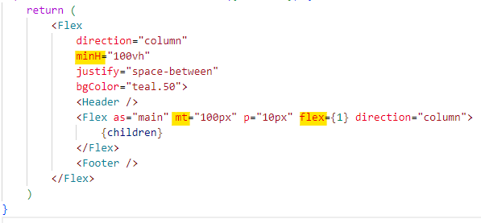

# Header scrolling

### [Github page Demo↗](https://joy-chang-2021.github.io/header_scrolling/)

- 註: 以 react (next.js) 及 chakra-ui 為例

### 滾動狀態控制 header 顯示效果

1. 進入畫面時預設顯示 header
2. 向下滾動時 header 滑出隱藏
3. 向上滾動時 header 滑入顯示

---

#### layout 元件 [↗](https://github.com/Joy-Chang-2021/header_scrolling/blob/main/app/_components/header-footer.js)

- CSS

  - layout `min-height: 100vh`
  - main `flex: 1`、`margin-top: 根據 header 高度調整`

  

#### Header 元件 [↗](https://github.com/Joy-Chang-2021/header_scrolling/blob/main/app/_components/header.js)

- JS

  1. 使用 `scrollY`、`scrollTop` 檢查滾輪的上下方向
  2. 使用 `scrollHeight`、`innerHeight` 檢查目前畫面在滾動範圍的位置  
      使用 nearTop / nearBottom / isContentFits 防範行動裝置於最頂/最底滑動時的微小抖動
     nearTop 數字可根據 header 實際高度測試調整  
     nearBottom、isContentFits 數字於行動裝置根據滾動測試調整
  3. 綜合使用 isScrollUp / nearTop / nearBottom / isContentFits 判斷設定 header 的顯示狀態
  4. 更新儲存此次的滾動位置、用於判斷下一次滾動時的方向
  5. 使用 requestAnimationFrame: 觸發時間也不固定，會依照當前裝置的渲染率，自動選在每個 Frame 的最佳時機去執行 callback 函數，讓動畫運算邏輯擁有最完整的間隔時間運算，優化畫面渲染的效果 ([reference](https://nick-chen.medium.com/你知道-settimout-setinterval-requestanimationframe-api-三者的關係嗎-89c7369a8ea0))

  

- CSS

  - `heigth` 根據內容調整，此以 100px 為例
  - `position: fixed`
  - `z-index` 確認可覆蓋其他內容即可，以 500 為例
  - `transform` 根據條件判斷 0 或 -100%
  - `transition` 滑入滑出動畫效果設定

  
